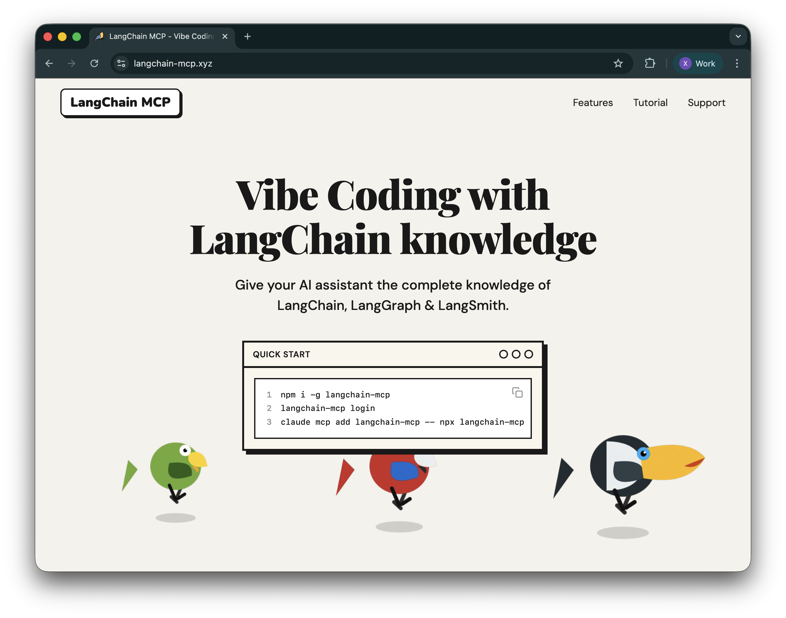

<div align="center">

# LangChain MCP

### Give your AI assistant complete knowledge of LangChain, LangGraph & LangSmith

[](https://langchain-mcp.xyz)
[](https://www.npmjs.com/package/langchain-mcp)
[](https://opensource.org/licenses/MIT)

[Website](https://langchain-mcp.xyz) • [Installation](#installation) • [Features](#features) • [Documentation](#documentation)

</div>

---

## Overview

**LangChain MCP** is a Model Context Protocol (MCP) server that provides semantic search across the entire LangChain ecosystem. Build AI applications faster with instant access to documentation and source code for LangChain, LangGraph, LangSmith, and DeepAgents.



## Features

- **Semantic Search** - Natural language queries across all LangChain ecosystem docs
- **Source Code Search** - Find code examples in Python and JavaScript repositories
- **MCP Protocol** - Works seamlessly with Claude Code, Claude Desktop, Cursor, and any MCP-compatible client
- **Production Ready** - Scalable API with authentication and usage tracking
- **Fast & Accurate** - Powered by ChromaDB and OpenRouter embeddings

## Installation

### Quick Start (Recommended)

```bash
# Install globally
npm install -g langchain-mcp

# Login with Google
langchain-mcp login

# Add to Claude Code
claude mcp add langchain-mcp -- npx langchain-mcp
```

### Manual Configuration

Add the following configuration to your client's config file:

**Claude Desktop**
- macOS: `~/Library/Application Support/Claude/claude_desktop_config.json`
- Windows: `%APPDATA%\Claude\claude_desktop_config.json`

**Cursor**
- macOS/Linux: `~/.cursor/mcp.json`
- Windows: `%USERPROFILE%\.cursor\mcp.json`

```json
{
  "mcpServers": {
    "langchain-mcp": {
      "command": "npx",
      "args": ["langchain-mcp"]
    }
  }
}
```

## Usage

### CLI Commands

```bash
langchain-mcp login      # Login via Google OAuth
langchain-mcp status     # Check usage and remaining credits
langchain-mcp logout     # Logout and clear credentials
```

### Available MCP Tools

| Tool | Description | Parameters |
|------|-------------|------------|
| `search_docs` | Search documentation, references, and tutorials | `query`, `limit` (default: 5) |
| `search_langchain_code` | Search LangChain source code | `query`, `language` (py/js), `limit` |
| `search_langgraph_code` | Search LangGraph source code | `query`, `language` (py/js), `limit` |
| `search_deepagents_code` | Search DeepAgents source code | `query`, `language` (py/js), `limit` |

## Pricing

- **Free Credits**: $5 per new user (~2000 searches)
- **Cost**: $0.0005 per 1K tokens (~$0.0025 per search)
- **Donation Bonus**: Donate $5, get $10 credits (200% match!)

Visit [langchain-mcp.xyz](https://langchain-mcp.xyz) for more details.

## Documentation

### For Developers

#### Project Structure

```
langchain-MCP/
├── packages/
│   ├── ingest/              # Python - Data ingestion (uv)
│   ├── api/                 # TypeScript - API server (Express)
│   ├── mcp-server/          # TypeScript - MCP client (npm package)
│   └── mcp-server-local/    # TypeScript - Local MCP server (dev)
├── config/
│   └── settings.json        # Shared configuration
└── deploy.sh                # Deployment script
```

#### Architecture

```
┌─────────────────┐     ┌──────────────────────┐     ┌─────────────────┐
│  Claude Desktop │────▶│  langchain-mcp       │────▶│   API Server    │
│   / Code / AI   │     │  (npm package)       │     │   (VPS)         │
└─────────────────┘     └──────────────────────┘     └─────────────────┘
                                                               │
                                                               ▼
                                                      ┌─────────────────┐
                                                      │   ChromaDB      │
                                                      │   + Embeddings  │
                                                      └─────────────────┘
```

#### Setup Development Environment

**1. Ingest Documentation & Source Code**

```bash
cd packages/ingest
uv sync
uv run ingest --list     # List available repositories
uv run ingest docs       # Ingest documentation only
uv run ingest            # Ingest all (docs + code)
```

**2. Run API Server**

```bash
cd packages/api
npm install
npm run dev              # Development server on port 3000
```

**3. Test Local MCP Server**

```bash
cd packages/mcp-server-local
npm install
npm run dev
```

#### Configuration

All settings in `config/settings.json`:

```json
{
  "embedding": {
    "provider": "openrouter",
    "model": "qwen/qwen3-embedding-8b"
  },
  "chromadb": {
    "path": "./data/chroma"
  },
  "chunking": {
    "docs": { "chunk_size": 2000, "chunk_overlap": 200 },
    "code": { "chunk_size": 4000, "chunk_overlap": 200 }
  },
  "repos": [
    {
      "name": "langchain",
      "url": "https://github.com/langchain-ai/langchain",
      "type": "code",
      "languages": ["python", "javascript"]
    }
  ]
}
```

#### Supported Embedding Providers

- `sentence-transformer` (local)
- `openai`
- `cohere`
- `google`
- `ollama`
- `openrouter` (default)

See [ChromaDB Integrations](https://docs.trychroma.com/integrations/chroma-integrations) for more options.

## Deployment

The project includes automated deployment scripts for VPS hosting:

```bash
# Manual deployment
./deploy.sh

# GitHub Actions (production branch)
git push origin main:production
```

Deployment includes:
- Code synchronization via rsync
- Automatic npm installation and build
- PM2 process management
- Nginx static file serving
- Environment variable management

## Roadmap

- [x] Semantic search across docs and code
- [x] Google OAuth authentication
- [x] Usage tracking and credits system
- [x] MCP registry registration
- [x] Claude Code, Desktop, and Cursor support
- [ ] Rate limiting (per user / per IP)
- [ ] Additional embedding model options
- [ ] Local mode (no API key required)
- [ ] Browser extension for quick searches
- [ ] VSCode extension integration

## Contributing

Contributions are welcome! Please feel free to submit a Pull Request.

1. Fork the repository
2. Create your feature branch (`git checkout -b feature/AmazingFeature`)
3. Commit your changes (`git commit -m 'Add some AmazingFeature'`)
4. Push to the branch (`git push origin feature/AmazingFeature`)
5. Open a Pull Request

## Support

- **Website**: [langchain-mcp.xyz](https://langchain-mcp.xyz)
- **Issues**: [GitHub Issues](https://github.com/baixianger/langchain-mcp/issues)
- **Donate**: Support development at [Ko-fi](https://ko-fi.com/baixianger)

## License

MIT License - see the [LICENSE](LICENSE) file for details.

---

<div align="center">

**Built with ❤️ by [baixianger](https://github.com/baixianger)**

[Website](https://langchain-mcp.xyz) • [GitHub](https://github.com/baixianger/langchain-mcp) • [npm](https://www.npmjs.com/package/langchain-mcp)

</div>
